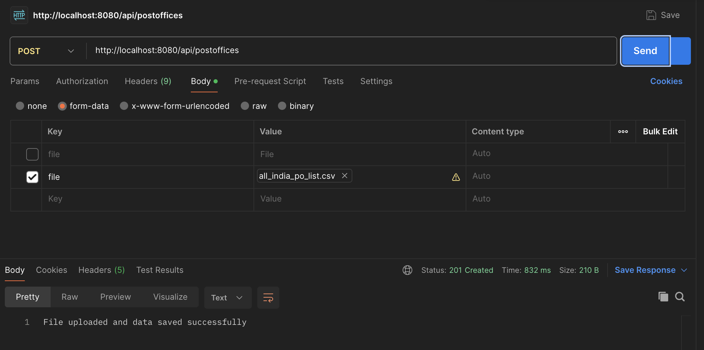

# Post Office API

## Overview

The Post Office API is a Spring Boot application designed to manage post office data. It provides endpoints to upload and manage information about post offices in India. This project uses an in-memory H2 database for development and testing purposes.

## Features

- **Endpoints**: Available through OpenAPI specification at [Swagger UI](http://localhost:8080/swagger-ui/index.html).
- **Database**: Uses H2 in-memory database.
- **File Upload**: Supports CSV file uploads for post office data.

## Getting Started

### Prerequisites

- Java 17
- Maven

### Running the Application

1. **Clone the repository:**

    ```bash
    git clone https://github.com/kks-it/postoffice.git
    cd post-office-api
    ```

2. **Build and run the application:**

    ```bash
    ./mvnw spring-boot:run
    ```

   Alternatively, you can run the application directly from the IDE by executing `src/main/java/com/backend/postofficeapi/PostOfficeApiApplication.java`.

### Testing Endpoints 

If you encounter any issue with the below endpoint in swagger. please follow the following steps:

1. **Upload CSV File:**

   Use Postman to test the file upload endpoint:

    ```bash
    curl --location 'http://localhost:8080/api/postoffices' \
    --form 'file=@"/path-to-file/all_india_po_list.csv"'
    ```

   In Postman:
   - Go to the `Body` tab.
   - Select `form-data`.
   - Choose `file` from the dropdown and select the CSV file.


    


2. **API Documentation:**

   View API documentation at [Swagger UI](http://localhost:8080/swagger-ui/index.html).

### Database Access

- **H2 Console:** Available at [H2 Console](http://localhost:8080/h2-console).
- **JDBC URL:** `jdbc:h2:mem:all-india-post-office`
- **Username:** `admin`
- **Password:** (Leave blank)

### Running Tests

- Run JUnit tests using the Maven commands:

    ```bash
    ./mvnw test
    ```

### Known Issues

- **Swagger Endpoint Issue:** The endpoint for `http://localhost:8080/api/postoffices` might not be properly generated in Swagger. Use Postman as an alternative.


- **Note:** Do not use `openapi.dev.url=http://dev.example.com` as the domain is not available. Ensure all configurations are updated according to your environment and CORS requests have not been configured.

- **TestException:** The `TestException` is deliberately thrown in `PostOfficeControllerTest.java` to test the test case.

### Contribution

Feel free to suggest improvements or report issues. Your feedback is welcome!

---


